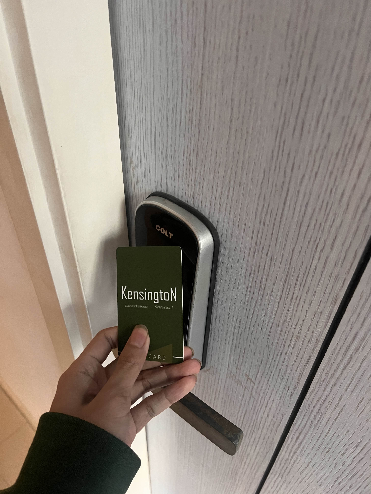

# Example of Security Controls in Daily Life

## Digital Door Lock (กลอนประตูดิจิตอล)
### สถานที่: คอนโด Kensington

- **Types of Security Controls:** Physical Controls
กลอนประตูดิจิตอลเป็นอุปกรณ์ที่ช่วยเสริมความปลอดภัยโดยจำกัดการเข้าถึงเฉพาะบุคคลที่ได้รับอนุญาตเท่านั้น ซึ่งจัดเป็นมาตรการควบคุมทางกายภาพ (Physical Control) ที่ช่วยป้องกันบุคคลภายนอกหรือผู้ไม่มีสิทธิ์จากการเข้าสู่พื้นที่สำคัญ ระบบนี้สามารถใช้งานผ่านรหัสผ่าน บัตร RFID หรือการสแกนลายนิ้วมือ ทำให้สามารถจัดการการเข้า-ออกได้อย่างมีประสิทธิภาพ
- **Control Functions:** Preventative
กลอนประตูดิจิตอลทำหน้าที่เป็นมาตรการควบคุมเชิงป้องกัน (Preventative Control) ซึ่งหมายถึงอุปกรณ์นี้ช่วยป้องกันไม่ให้บุคคลที่ไม่ได้รับอนุญาตสามารถเข้าถึงพื้นที่สำคัญหรือข้อมูลที่เป็นความลับ ช่วยลดความเสี่ยงของการบุกรุก และเพิ่มระดับความปลอดภัยของสถานที่โดยกำหนดให้ผู้ใช้งานต้องผ่านกระบวนการยืนยันตัวตนก่อนเข้าถึงพื้นที่
